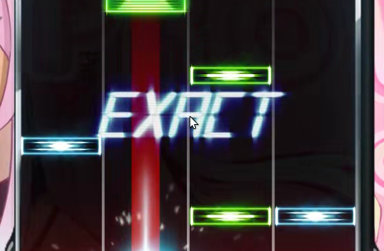
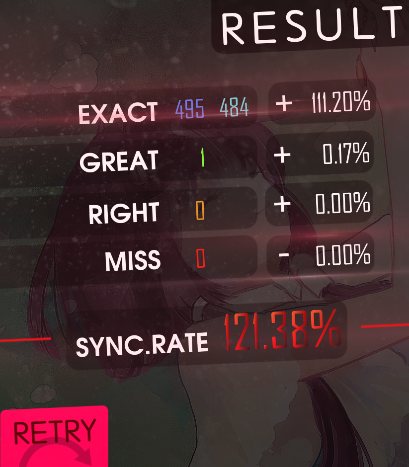
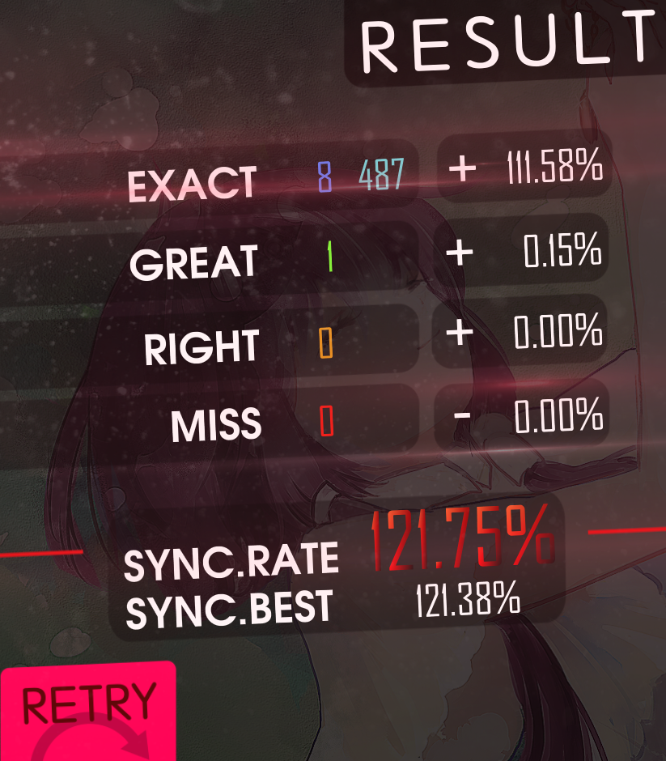
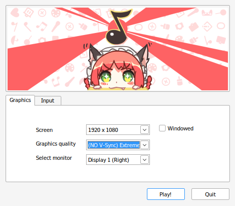

Unofficial quality of life modifications for the PC version of the hit video game Musynx (stylized as MUSYNX, sometimes also known as Musync) using MelonLoader.

# Disclaimers
- These mods are unofficial and are not associated with, related to, and/or endorsed by I-Inferno and/or Wave Game.
- USE AT YOUR OWN RISK. NO WARRANTIES.
- Please read [FAQ](#frequently-asked-questions).

# Mod list
There are currently four mods available in this repo: three are interface enhancements, and another one can be used to disable vSync and other FPS caps that are otherwise baked into the game.

- [Optional options](#optional-options) — allows to skip the settings screen on song select, starting the game immediately
- [Hidden cursor](#hidden-cursor) — hides the mouse cursor during gameplay
- [Plentiful stats](#plentiful-stats) — provides some data for the stats screen
- [VSync annihilator](#vsync-annihilator) — allows the game to run without vSync, with optional custom FPS cap (you probably won't need this)

## Optional options
Mod file: `OptionalOptions.dll`

This mod skips the settings screen on song select by default, starting the game using saved settings for theme, speed, and offsets.

Selecting a song with this mod will look like this:

TODO include the video via github web interface

In this video, you can see [Hidden cursor](#hidden-cursor) kicking in as well.

To access the settings screen, hold Shift key when starting a song.

## Hidden cursor
Mod file: `HiddenCursor.dll`

This mod hides the cursor during gameplay, preventing stuff like this:


The cursor is still shown when the game is paused, and in all other screens.

## Plentiful stats
Mod file: `PlentifulStats.dll`

This mod adds some extra features for the stats screen after a song has been played:
| Before | After |
| --- | --- |
|  |  |

Features include:
1. Blue exacts are counted separately from cyan exacts  
(top middle of the pictures)
2. Previous best score is shown alongside the current one  
(bottom middle of the pictures)
3. R key can be used to restart the song alongside F1 key  
(not pictured; also, due to implementation quirks, works with the in-game pause menu, too)

### Configuration
All features of the mod can be toggled on and off independently via the preferences file, `UserData/MelonPreferences.cfg`. Launching the game with the mod installed should create the following section in the file:
```toml
[Bnfour_PlentifulStats]
# Enables R key to restart from the stats screen.
RToRestart = true
# Displays separate blue and cyan exacts counts.
SeparateExacts = true
# Displays previous best score at the stats screen.
PrevBest = true
```

Set to `false` to disable a feature.

## VSync Annihilator
Mod file: `VSyncAnnihilator.dll`

> [!WARNING]
> Please read the full description before installing!
>
> If you're content with your framerate, just skip this mod.
>
>It's intended for setups where, [for whatever reason](https://youtu.be/iYWzMvlj2RQ), vSync FPS cap does not match actual display FPS. For me, vSync is set to 120 FPS even though I use 240 Hz display (it's also 120 FPS on other non-120 Hz displays I have). Again, if you never thought you should change your FPS, this mod is not for you.

This mod disables vSync (and capping FPS to 60, usually overrided by active vSync) in game, providing a changeable custom FPS cap instead.

### Installation
The game engine generally does not like changing the vSync setting at runtime — it may cause lags. All default game's quality presets enable vSync. The solution is to use the provided script, `resource-patcher.py`, to patch the highest quality preset to remove vSync. The mod will warn you in the console if this step was skipped. After an update to the game, the file should probably be patched again.

> [!TIP]
> The script is written in Python, so you'll need a reasonably recent version of it installed.

```bash
python resource-patcher.py path/to/steam/common/MUSYNX/MUSYNX_Data/globalgamemanagers
```
where `path/to/steam` is actual path to your Steam library. Please make sure to target `globalgamemanagers` file (no extension), **not** `globalgamemanagers.assets`, and **not** `globalgamemanagers.assets.resS`.

If the preset was patched successfully, its name in setup will change:


Select it to start the game without vSync. The actual mod, if installed, will keep it disabled. (Without it, the game will eventually turn it on again, and/or force the 60 FPS cap.)

The `globalgamemanagers` file can be restored to original state by running the script on it again or using Steam's "verify integrity of game files" feature.

### Configuration
The mod's custom FPS cap (240 by default — solely because it's the value I use) can be adjusted via MelonLoader's preferences framework. Launching the game with the mod installed should generate the following section in `UserData/MelonPreferences.cfg` (you can also put it here in advance):
```toml
[Bnfour_VSyncAnnihilator]
# Frame limit not related to vSync. 0 for no limit -- the game will run as fast as it can, may break.
TargetFramerate = 240
```

The value of `TargetFramerate`, if non-zero, is passed to the engine as [`Application.targetFrameRate`](https://docs.unity3d.com/ScriptReference/Application-targetFrameRate.html).

If the config value is zero, the game runs as fast as it can. I wouldn't recommend this, as with really high FPS (I got 1500+) things seem to be messed up. Also note that, for technical reasons, the resulting FPS may differ from the cap (for me, 600 FPS cap results in about 640 FPS in game, and 240 FPS cap is 246 actual FPS).

## Experimental mod
This is not a mod intended for using. Rather, it's a developmental test bed for me to test random stuff without changing existing proper mods. All current mods (except Plentiful stats) were prototyped as a single do-it-all unimaginable horror abomination here first and then rewritten to be modular cute things currently present.

The project contains the bare minimum for a mod that is successfully loaded; it does nothing except posting a single message in the log.

# Installation
These are [MelonLoader](https://melonwiki.xyz/) mods. In order to run these, you need to have it installed. Currently, 0.6.1 Open-Beta of MelonLoader is supported.  
Once you have MelonLoader installed, drop the DLLs of desired mods into the `Mods` folder. Remove to uninstall.  

> [!NOTE]
> For VSync annhilator (if you need it: probably not), refer to its own [installation section](#installation) for additional instructions.

Rather than downloading these, I suggest (reviewing the source and) building them yourself — this way you'll be sure the mods behave as described. See ["Building from source"](#building-from-source).  
Otherwise, please verify the downloads.

## Verification
Every published release is accompanied with SHA256 hashes of every DLL. MelonLoader does print these in console when loading mods, but I suggest to verify the hashes before installation.

# Frequently Asked Questions
(or, more accurately, "I thought you may want to know this")

### Is this cheating?
_tl;dr: no_

The mods provide no advantage for the actual gameplay, only some convinence in in the menus (and maybe a fix for broken vSync framerate). You still have to git gud to earn high scores.

Unless you count _any_ changes to the game for _any_ purpose as cheating, this is not cheating.

### Will I get banned for using these?
_tl;dr: probably not, but NO WARRANTIES; USE AT YOUR OWN RISK_

As I stated in previous question, I don't believe this is cheating. I've been using these for a while, and my account is still there. But there's a reason for the all-caps section of the license about having no warranties: the devs might think otherwise or break the compatibility (un)intentionally.

Remember that you're using the mods **at your own risk**.

### I have other mods. What about compatibility with them?
_tl;dr: ¯\\\_(ツ)\_/¯_

Some of the mods override vanilla methods, so other mods that use these may not work.

### My game is broken because of you and your mods, how can I fix this and blame you?
_tl;dr: uninstall, and remember: NO WARRANTIES_

If you just want to play the game, removing the mods (and maybe the modloader itself) is always an option.
* Please make sure you're using supported (**0.6.1**) version of MelonLoader.
* Try to remove mods not from this repo.
* Try to remove mods and/or modloader and check whether the vanilla game is broken too.

If none of these helps, feel free to submit an issue, unless it's already have been reported.

### There's nothing in the console after the actual game starts?
_tl;dr: `tail -f MelonLoader/Latest.log`_

For whatever reason, the built-in MelonLoader console does not display logs after the game (as opposed to the config app) starts. This includes messages about loading the mods and any messages they produce.

The log file, located at `MelonLoader/Latest.log`, is still updated in real time with all data. You can use any tool to monitor the file.

# Building from source
This repo is a run-of-the-mill .NET solution targeting .NET 4.7.2.

The only gotcha is that some libraries required to build it are not included because of file size (and licensing) issues. Your installation of MelonLoader will generate them for you.

Copy everything from `MelonLoader/Managed`, `MelonLoader/net35`, and `MUSYNX_Data/Managed/` folders from the game install to the `references` folder of this repo. All the DLLs should be directly in the `references` folder, no subfolders.

This should cover the local references for all the projects. (Actually, **most** of the DLLs are not necessary to build the solution, I just don't plan on keeping an accurate and up to date list of required libraries.)

After that, just run `dotnet build`.
