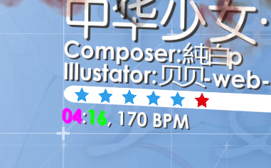

Unofficial quality of life modifications for the PC version of the hit video game Musynx (stylized as MUSYNX, sometimes also known as Musync) using MelonLoader.

# Disclaimers
- These mods are unofficial and are not associated with, related to, and/or endorsed by I-Inferno and/or Wave Game.
- USE AT YOUR OWN RISK. NO WARRANTIES.
- Please read [FAQ](#frequently-asked-questions).

# Mod list
The following mods are currently available in this repo:

- [Optional options](#optional-options) — allows to skip the settings screen on song select, starting the game immediately
- [Hidden cursor](#hidden-cursor) — hides the mouse cursor during gameplay
- [Plentiful stats](#plentiful-stats) — provides some data for the stats screen
- [Skin tweaks](#skin-tweaks) — improvements for some of the skins
- [Menu tweaks](#menu-tweaks) — improvements for song selection menus
- [Quick quit and restart](#quick-quit-and-restart) — adds in-game hotkeys
- [Song info](#song-info) — adds song's duration and BPM to song selection menus
- [VSync annihilator](#vsync-annihilator) — allows the game to run without vSync, with optional custom FPS cap (you probably won't need this)

## Optional options
Mod file: `OptionalOptions.dll`

This mod skips the settings screen on song select by default, starting the game using saved settings for theme, speed, and offsets.

Selecting a song with this mod will look like this:

https://github.com/bnfour/mx-mods/assets/853426/4dc917ce-85bf-4dc7-aec3-4a541e530e36

In this video, you can see [Hidden cursor](#hidden-cursor) kicking in as well.

To access the settings screen, hold Shift key when starting a song.

## Hidden cursor
Mod file: `HiddenCursor.dll`

This mod hides the cursor during gameplay, preventing stuff like this:


The cursor is still shown when the game is paused, and in all other screens.

## Plentiful stats
Mod file: `PlentifulStats.dll`

This mod adds some extra features and fixes for the stats screen after a song has been played; all can be independently turned on or off.

### Available features

#### Extra data
The statistics display is changed:

| Before | After |
| --- | --- |
|  |  |

1. Blue exacts are counted separately from cyan exacts  
(top middle of the pictures)
2. Previous best score is shown alongside the current one  
(bottom middle of the pictures)

#### Extra keybind
R key can be used to restart the song alongside F1 key. Due to implementation quirks, works with the in-game pause menu, too!

#### Localization fix
This feature (more of an unofficial bugfix, actually 🤓) changes the "NEXT" button being "继续" when the score is 120% or more and language other than Chinese is used:

| Lower score reference | Before | After |
| --- | --- | --- |
|  |  |  |

I'd love to see an official fix for this implemented. ٩(◕‿◕)۶

### Configuration
All features of the mod can be toggled on and off independently via MelonLoader's preferences file, `UserData/MelonPreferences.cfg`. Launching the game with the mod installed should create the following section in the file:
```toml
[Bnfour_PlentifulStats]
# Enables R key to restart from the stats screen.
RToRestart = true
# Displays separate blue and cyan exacts counts.
SeparateExacts = true
# Displays previous best score at the stats screen.
PrevBest = true
# Fixes Next button switching to Chinese on 120+ scores.
EnNextFix = true
```

Set to `false` to disable a feature.

## Skin tweaks
Mod file: `SkinTweaks.dll`

This is a collection of improvements to some of the in-game skins. All features can be turned on and off separately.

### Available features

#### Disabled mountain overlay for Ink2D
This disables the moving mountain overlay images on Ink2D for cleaner looks. I also find their sudden disappearance quite jarring (but you don't have to agree with me).

| Before | After |
| --- | --- |
|  |  |

#### Improved long note scoring for Techno2D and STG2D
This updates the score display present on Techno2D and STG2D whenever the long note is played at least partially. On some charts, long notes at the very end make skin's display score inconsistent with final results:

https://github.com/user-attachments/assets/445e69c4-f2a8-4841-8e70-336dbd5948b1

(Results screen modified by [Plentiful stats](#plentiful-stats))

Compare with the score being updated on long note releases (legacy/simple scoring):

https://github.com/user-attachments/assets/c5b4fe86-c2d2-45e8-a7a6-27cb0e60ebd4

Or with the score being updated on every combo tick:

https://github.com/user-attachments/assets/ec62569f-dde0-4d96-93f6-3837f2179225

#### Background image for STG2D
This adds background for STG2D. The opacity of background is configurable using 0–100 percentage:
| 0% or not enabled | 33% — default | 100% — fully opaque |
| --- | --- | --- |
|  |  |  |

### Configuration
All features of the mod can be toggled on and off independently via MelonLoader's preferences file, `UserData/MelonPreferences.cfg`. Launching the game with the mod installed should create the following section in the file:
```toml
[Bnfour_SkinTweaks]
# Removes moving white mountain overlays from Ink2D.
MountainRemoval = true
# Updates the score display on Techno2D and STG2D for long notes.
LongNoteScoring = true
# Updates the score display on Techno2D and STG2D for long notes every combo tick. If disabled, the score is updated on long note release.
AdvLongNoteScoring = true
# Enables display of background art for STG2D.
STGBackground = true
# Opacity for the background image, percent. 0 is fully transparent, 100 is fully opaque.
STGBackgroundOpacity = 33
```

Set to `false` to disable a feature.

`AdvLongNoteScoring` controls scoring behavior (if it is enabled by `LongNoteScoring`):
- `true` to update on every combo tick (advanced scoring, see the third video demo)
- `false` to update on long note releases (legacy scoring, see the second video demo)

`STGBackgroundOpacity` controls the opacity of the background art. Has no effect if `STGBackground` is set to `false`.

> [!TIP]  
> The mod will notify you if it's configured to do nothing, and can be disabled.

## Menu tweaks
Mod file: `MenuTweaks.dll`

This is a collection of changes for the song selection menus. All features can be toggled on and off independently.

### Available features

#### Fix for ordinal numbers
This fixes suffixes for player rank sometimes not matching the number itself:
| Menu | Before | After |
| --- | --- | --- |
| Main |  |  |
| List |  |  |

#### Mute
This mutes the various beep/clang/whatever-you-hear sounds in the menu, leaving only the music preview. That's it.

#### Consistent text shadows
This makes text shadows in the big menu the same color, either dark gray or pure black which are both used in vanilla:
| Mode | Image |
| :---: | --- |
| None<br/>(vanilla for comparison) |  |
| Lighten darker shadows<br/>(default) |  |
| Darken lighter shadows |  |

Note that in vanilla, text on the left (song title, composer and/or illustrator info, Song info data) uses gray shadows, while text on the right ("World", "Ranking", "NN TH") uses black shadows.

#### No warping for songs with no Inferno difficulty in the list menu
This prevents switching to another song when attempting to select Inferno difficulty for a song that lacks one. When this is on, pressing right on a Normal song with no Inferno version will do nothing, similar to pressing left on an Easy song.

Only for the list (small) menu.

### Configuration
All features of the mod can be toggled on and off independently via MelonLoader's preferences file, `UserData/MelonPreferences.cfg`. Launching the game with the mod installed should create the following section in the file:
```toml
[Bnfour_MenuTweaks]
# Fixes suffixes for your rank in song selection menus.
OrdinalsFix = true
# Mutes menu sounds, leaving only song preview.
Mute = true
# Makes text shadows in the big menu the same color.
ShadowsFix = true
# What to do with the text shadows -- lighten the darker ones or darken the lighter ones to match the others.
ShadowsFixMethod = "Lighten"
# Prevents difficulty switch also changing the song when the selected song has no Inferno difficulty for the list (small) menu
NoInfernoWarping = true
```

Set boolean flags to `false` to disable a feature. `ShadowsFixMethod` accepts either `"Lighten"` or `"Darken"` (note the quotes) to specify the shadow color; has no effect if `ShadowsFix` is off.

> [!TIP]  
> The mod will notify you if it's configured to do nothing, and can be disabled.

## Quick quit and restart
Mod file: `QuickQuit.dll`

This small mod adds hotkeys to quickly quit or restart the current level without entering the pause menu:
- `Backspace` to restart the level
- `Delete` to quit to song selection

The hotkeys work if the game can be paused (not too early nor too late into the level).

## Song info
Mod file: `SongInfo.dll`

This mod adds essential data about the currently selected song: its duration, BPM, and whether it has scroll speed changes mid-track (because I get surprised by them every single time):

| Default "big" menu | List menu |
| --- | --- |
|  |  |
| | |

On this label:
- Duration is displayed as `MM:SS`, like `01:34` — the value matches the one Techno2D skin displays, so it might not be completely accurate for certain songs.
- Minimum and maximum BPM used in the map are shown — there might be changes to other BPM values within the range. Single number indicates no BPM changes throughout the map.
- If there are _any_ scroll speed changes (not to be confused with BPM changes), the label will have `SV!` at the end. (SV allegedly stands for "Slider Velocity" in osu! terms) <!-- i just went "oh, that's how this bane of my existence is called" while watching one of the world cups -->

### Cache details and (ab)use (advanced)
This mod saves the data about the songs for future reuse in `MUSYNX_Data/song_info_cache.json` file. That file is saved on every game exit. There is currently no way to disable caching — if deleted, the file will be regenerated as long as the mod is active.

<details>
<summary>The cache can be edited manually for fun(?), but this is unsupported. Venture forth at your own risk.</summary>

The file itself is a simple JSON dictionary:
```jsonc
{
    "songId, like 124503": {
        // pre-formatted as a string
        "Duration": "02:42",
        // ditto
        "Bpm": "115",
        "HasSv": false
    },
    // ... and so on, each difficulty for each mode can create an entry if visited,
    // so, 6 entries per song at most, (EZ, HD, IN) × (4K, 6K)
}
```
(the original JSON is not pretty-formatted for technical reasons)

The dict's keys are internal song IDs (as strings), unique for mode/difficulty combo, because sometimes BPM and SV differ between difficulty levels.

The BPM and duration are stored as an already formatted strings, and manual changes to those will be shown in-game. This is not really useful nor intended feature, but it works nonetheless. The text label supports rich text, so the [tags for Unity 2017.4](https://docs.unity3d.com/2017.4/Documentation/Manual/StyledText.html) should work. For example, an entry
```json
"137602":{"Duration":"<color=#ff00ff>04</color>:<color=#00ff00>16</color>", "Bpm":"170", "HasSv":false}
```
in the cache file will result in the following display for 4K HD 中华少女 · 终:



The color is applied to both text components — after all, this feature is officially unsupported (for now?)  
Of course, any arbitrary text can be put there, though the comma and "BPM" bits are hardcoded and will always be included.

**Please note:** if the cache file contains malformed JSON, it will be replaced with the regenerated valid cache on (regular) game exit.

</details>

## VSync annihilator
Mod file: `VSyncAnnihilator.dll`

> [!WARNING]
> Please read the full description before installing!
>
> If you are content with your framerate, just skip this mod.
>
>This mod is intended for setups where both vSync FPS and FPS cap presets (60 and 120 available as of 2024-04-30 update) do not match actual display FPS. For me, [for whatever reason](https://youtu.be/iYWzMvlj2RQ), vSync is set to 120 FPS even for a 240 Hz display.
>
> Again, if you never thought you should change your FPS, this mod is not for you.

This mod disables vSync before the game even starts for _allegedly_ better performance, and provides a custom FPS cap instead of vanilla 60/120.

### Installation
The game engine _allegedly_ does not like changing the vSync setting at runtime — it may cause lags. All default game's quality presets enable vSync. The solution is to use the provided script, `resource-patcher.py`, to patch the highest quality preset to remove vSync. The mod will warn you in the console if this step was skipped. After an update to the game, the file must be patched again.

> [!TIP]
> The patching script is written in Python, so you'll need a reasonably recent version of it installed.

```bash
python resource-patcher.py path/to/steam/common/MUSYNX/MUSYNX_Data/globalgamemanagers
```
where `path/to/steam` is actual path to your Steam library. Please make sure to target `globalgamemanagers` file (no extension), **not** `globalgamemanagers.assets`, and **not** `globalgamemanagers.assets.resS`.

If the preset was patched successfully, its name in setup will change:


Select it to start the game without vSync. The actual mod, if installed, will keep it disabled. (Without the mod, the game may eventually turn it on again, and/or force the 60/120 FPS cap found in its settings.)

The `globalgamemanagers` file can be restored to its original state by running the script on it again or using Steam's "verify integrity of game files" feature.

### Configuration
The mod's custom FPS cap (240 by default — solely because it's the value I use) can be adjusted via MelonLoader's preferences framework. Launching the game with the mod installed should generate the following section in `UserData/MelonPreferences.cfg` (you can also put it here in advance):
```toml
[Bnfour_VSyncAnnihilator]
# Frame limit not related to vSync. 0 for no limit -- the game will run as fast as it can, may break.
TargetFramerate = 240
```

The value of `TargetFramerate`, if non-zero, is passed to the engine as [`Application.targetFrameRate`](https://docs.unity3d.com/ScriptReference/Application-targetFrameRate.html).

If the config value is zero, the game runs as fast as it can. I wouldn't recommend this, as with really high FPS (I got 1500+) things seem to be messed up. Also note that, for technical reasons, the resulting FPS may differ from the cap (for me, 600 FPS cap results in about 640 FPS in game, and 240 FPS cap is 246 actual FPS).

## Experimental mod
This is not a mod intended for using. Rather, it's a developmental test bed for me to test random stuff without changing existing proper mods. A few first mods were prototyped as a single do-it-all unimaginable horror abomination here first and then rewritten to be modular cute things currently available in this repo; newer ones also were prototyped here.

The project contains the bare minimum for a mod that is successfully loaded; it does nothing except posting a single message in the log.

# Installation
These are [MelonLoader](https://melonwiki.xyz/) mods. In order to run these, you need to have it installed. Currently, 0.7.1 Open-Beta of MelonLoader is supported.  
Once you have MelonLoader installed, drop the DLLs of desired mods into the `Mods` folder. Remove to uninstall.

> [!NOTE]
> For VSync annihilator (if you need it: probably not), refer to its own [installation section](#installation) for additional instructions.

Rather than downloading these, I suggest (reviewing the source and) building them yourself — this way you'll be sure the mods behave as described. See ["Building from source"](#building-from-source).  
Otherwise, please verify the downloads.

## Verification
Every published release is accompanied with SHA256 hashes of every DLL. MelonLoader does print these in console when loading mods, but I suggest to verify the hashes before installation.

# Frequently Asked Questions
(or, more accurately, "I thought you may want to know this")

### Is this cheating?
_tl;dr: no_

The mods provide no advantage for the actual gameplay, only some convenience in in the menus (and maybe a fix for broken vSync framerate). You still have to git gud to earn high scores.

Unless you count _any_ changes to the game for _any_ purpose as cheating, this is not cheating.

### Will I get banned for using these?
_tl;dr: probably not, but NO WARRANTIES; USE AT YOUR OWN RISK_

As I stated in previous question, I don't believe this is cheating. I've been using these for a while, and my account is still there. But there's a reason for the all-caps section of the license about having no warranties: the devs might think otherwise or break the compatibility (un)intentionally.

Remember that you're using the mods **at your own risk**.

### I have other mods. What about compatibility with them?
_tl;dr: ¯\\\_(ツ)\_/¯_

Some of the mods override vanilla methods, so other mods that use these may not work.

### My game is broken because of you and your mods, how can I fix this and blame you?
_tl;dr: uninstall, and remember: NO WARRANTIES_

If you just want to play the game, removing the mods (and maybe the mod loader itself) is always an option.
* Please make sure you're using supported (**0.7.1**) version of MelonLoader.
* Try to remove mods not from this repo.
* Try to remove mods and/or mod loader and check whether the vanilla game is broken too.

If none of these helps, feel free to submit an issue, unless it's already have been reported.

### There's nothing in the console after the actual game starts?
_tl;dr: update to MelonLoader 0.7.0+, or `tail -f MelonLoader/Latest.log`_

For whatever reason, the built-in MelonLoader 0.6.1's console does not display logs after the game (as opposed to the config app) starts. This includes messages about loading the mods and any messages (warnings, errors) they produce.

The log file, located at `MelonLoader/Latest.log`, is still updated in real time. You can use any tool to monitor the file contents, such as ubiquitous `tail`, for example.

The issue is also fixed in MelonLoader 0.7.0 and newer.

# Building from source
This repo is a run-of-the-mill .NET solution targeting .NET 4.7.2.

The only gotcha is that some libraries required to build it are not included because of file size (and licensing) issues. Your installation of MelonLoader will generate them for you.

Copy everything from `MelonLoader/net35` and `MUSYNX_Data/Managed` folders from the game install to the `references` folder of this repo. All the DLLs should be directly into it, no subfolders.

This should cover the local references for all the projects. (Actually, **most** of the DLLs are not necessary to build the solution, I just don't plan on keeping an accurate and up to date list of required libraries.)

After that, just run `dotnet build`.
